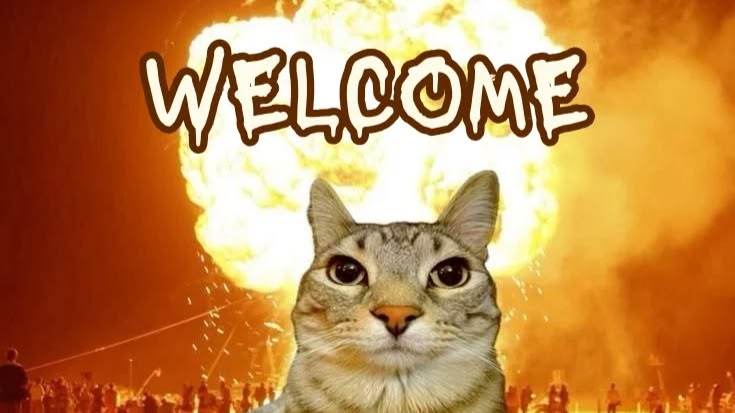

# Добро пожаловать в моё портфолио!

Привет! Я студентка 2об_ПОО, и это моё портфолио с лабораторными работами и проектами. Здесь собраны все задания, которые я выполнила в рамках курса.

  

---

## 📚 Что здесь есть

- **Лабораторные работы** – все задания с 1 по 6, включая дополнительное задание 6LR.  
  Перейти → [Обзор лабораторных](labs/index.md)
- **BPMN-диаграммы** – моделирование бизнес-процессов.  
  Перейти → [BPMN](labs/BPMN.md)
- **Финальные задания** – две части итогового проекта.  
  Перейти → [Часть 1](labs/finish_line1.md) · [Часть 2](labs/finish_line2.md)

---

## 🛠️ Используемые технологии

- Markdown + MkDocs с темой Material
- Git и GitHub Pages
- [Ваши дополнительные технологии](https://chat.deepseek.com/a/chat/s/245d355e-4883-45f7-ad36-dae704f75535)

---

## 📬 Контакты

Связаться со мной ~~можно~~ через [GitHub](https://github.com/polinaa86)

---

_Спасибо, что заглянули! 😊_
