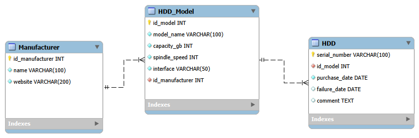

# Лабораторная работа №5. Нормализация базы данных (3НФ)

**Задание**: Нормализовать базу данных о жёстких дисках до 3НФ.

**Результат**: Разработана схема из 3 таблиц (`Manufacturer`, `HDD_Model`, `HDD`) с первичными и внешними ключами.

**Суть**: Исходное отношение декомпозировано по функциональным зависимостям. Все таблицы соответствуют 3НФ и НФБК. Создан SQL-скрипт для MySQL Workbench.

Ссылка: [Нормализация базы данных (3НФ)](https://docs.google.com/document/d/1p_vjah_T8LwEoMMGcUsmmKXdF9ys5KPoHR97bSMaLzU/edit?tab=t.0)
