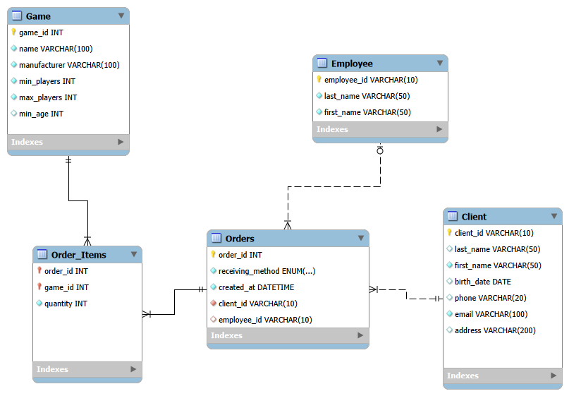

# Лабораторная работа №6. Определение ограничений целостности

**Задание**: 
Спроектировать базу данных для магазина настольных игр. Выделить сущности, определить первичные и альтернативные ключи, обязательные атрибуты, условия проверки, связи и внешние ключи.

**Результат**: 
Разработана схема БД с полным набором ограничений: PK, FK, UNIQUE, NOT NULL. Определены связи. Реализован SQL-скрипт в MySQL Workbench.

**Суть**: 
Выполнен анализ предметной области, для каждой сущности определены потенциальные ключи и обязательные поля. Для варианта "сотрудник → только один заказ" предложено добавить `UNIQUE(employee_id)`. Связи реализованы через внешние ключи с каскадными ограничениями.

Ссылка на выполненное задание:
[Определение ограничений целостности](https://docs.google.com/document/d/1FfoKUFG74dFtbOM48xzJl2y7XW16XI0H5S4Q1FFPFMI/edit?tab=t.0)
