# Отчёт по лабораторной работе  

Учебное учреждение: **РГПУ им. А. И. Герцена**

Дисциплина: **Информационные системы и базы данных**

Выполнила лабораторную работу: **Тоголмачева Полина Эдуардовна**

Группа: **2об_ПОО**

Дата выполнения: 26.06.2026

## Тема: Документо-ориентированная СУБД MongoDB: CRUD-операции, вложенные структуры и индексы  

### Цель работы: 
Освоить создание БД и коллекций, выполнение CRUD-операций, работу с массивами и вложенными объектами, создание индексов и анализ производительности, а также использование конвейера агрегации в MongoDB.

---

## Локальная установка MongoDB Community Edition
### Пошаговые действия:

1. Первым делом я зашла на официальный сайт [https://www.mongodb.com/try/download/community](https://www.mongodb.com/try/download/community)

2. И промотала ползунок вниз, затем нашла свою версию виндовс и формат в котором хотела бы скачать MongoDB

3. Нажала на кнопку "Скачать" и далее мне высвечивались следующие окна, где я нажимала соответствующие кнопки для успешной загрузки:

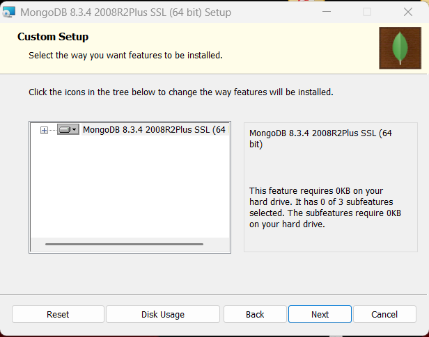
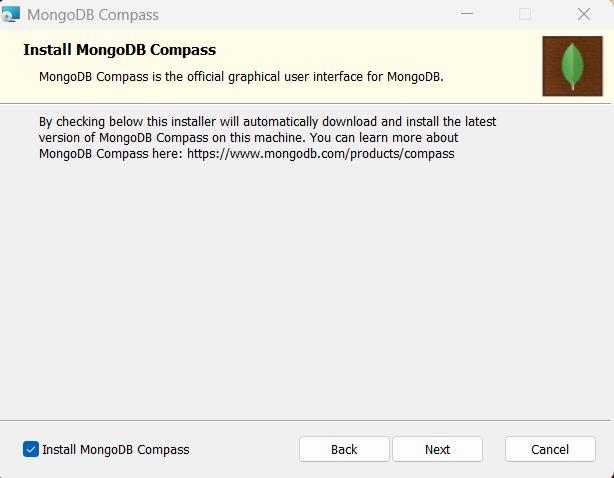
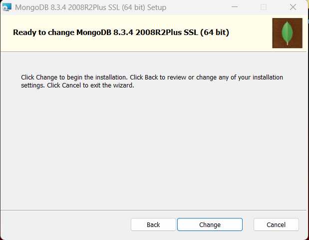
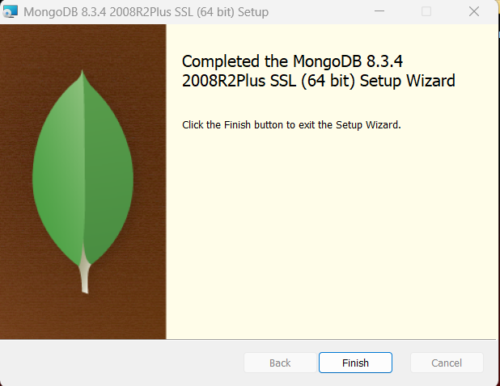

4. Я успешно установила инструмент MongoDB и теперь могу спокойно приступить к подключению к серверу

## Создание папки данных MongoDB и запуск сервера MongoDB

1. Первым делом я нажала на зеленую кнопку "Add New Connection"

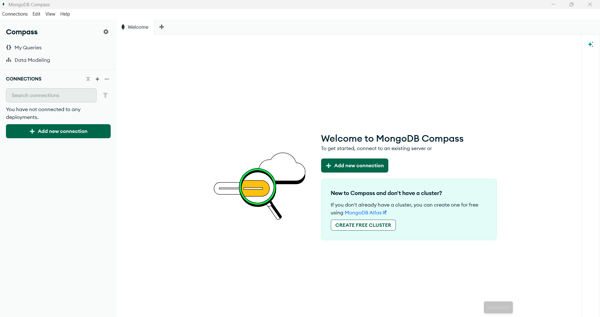

2. Здесь я ввела адрес сервера, который мне дал преподаватель 

3. Я успешно подключилась к серверу

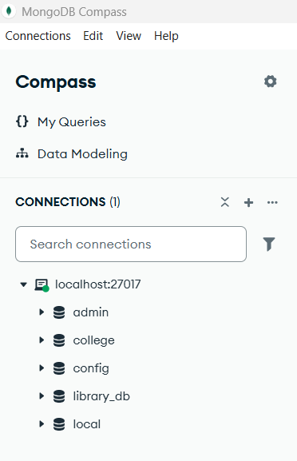

## Предварительные действия перед началом работы

1. Я переключаюсь успешно на базу library_db

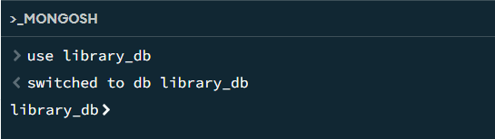

2. Далее создаю коллекцию books для хранения книг и осуществляю просмотр коллекции текущей базы

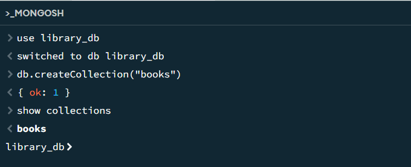

## Добавление тестовых данных в коллекцию books

На данном этапе осуществляется добавление 20 тестовых документов в коллекцию books

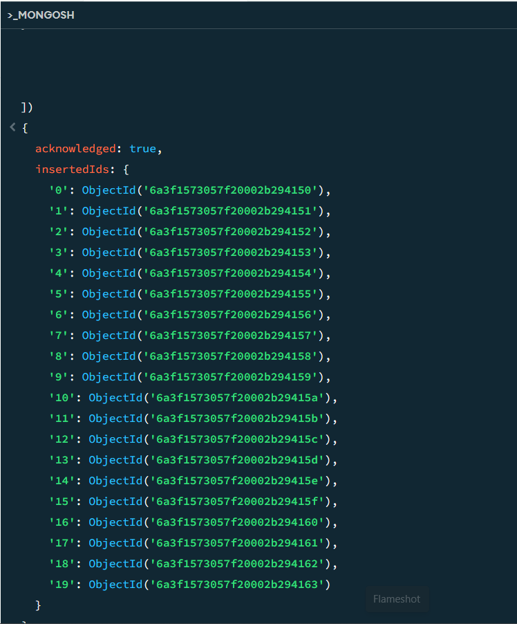

Проверка количества добавленных книг

## Уровень 1. Базовые CRUD-операции (15 баллов)

**Задание 1. Поиск документов с фильтрацией**

### Постановка задачи

Научиться выполнять поиск документов по условиям.

Необходимо найти:

* книги дороже 500;
* книги, выпущенные раньше 2000 года;
* книги определённых жанров.

---

1. Поиск книг дороже 500

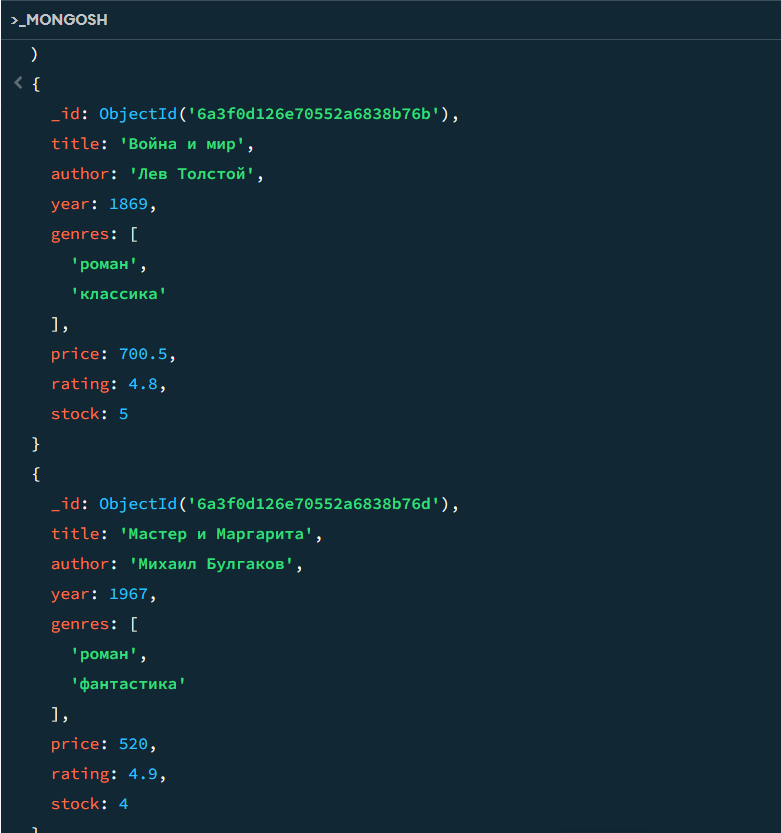

2. Поиск книг до 2000 года

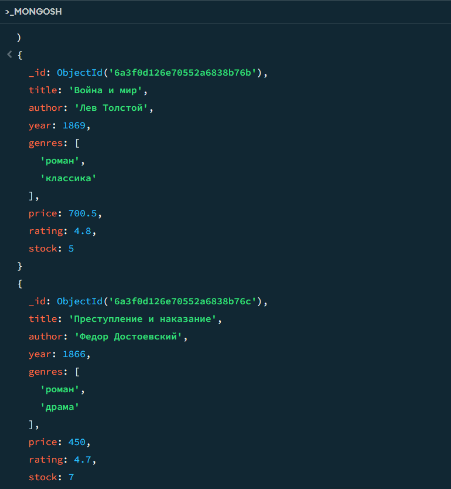

3. Поиск по нескольким жанрам

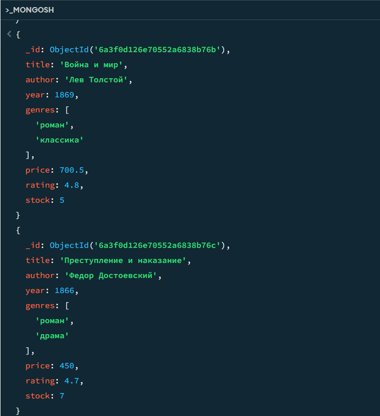

**Задание 2. Проекция данных**

## Постановка задачи

Научиться управлять выводом полей документа.

Необходимо вывести только:

* название книги;
* автора.

Поле `_id` скрыть.

---

Вывод только title и author

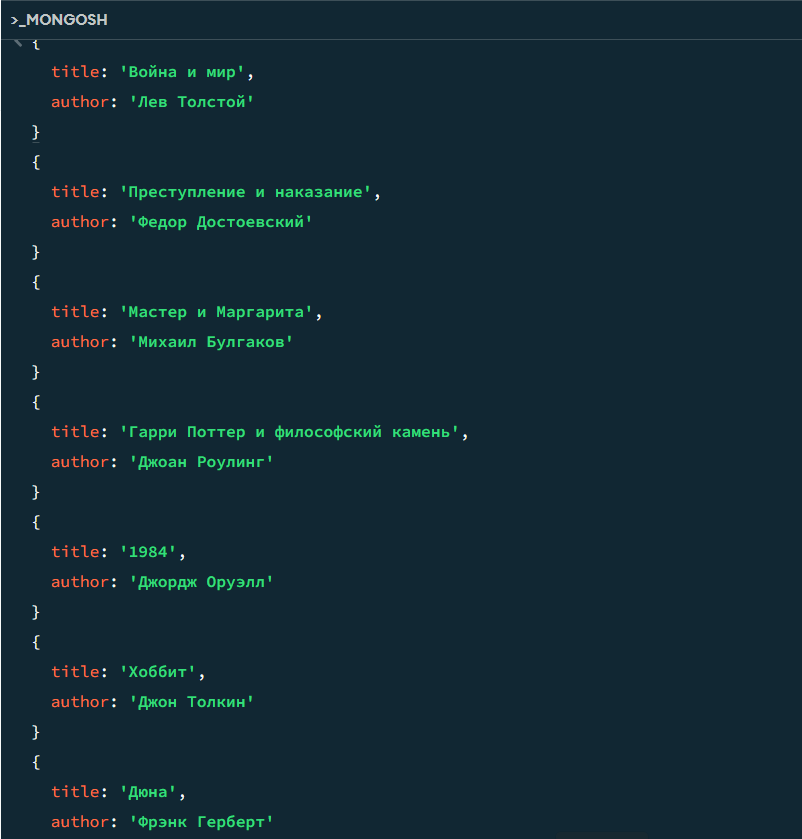

**Задание 3. Сортировка результатов**

## Постановка задачи

Отсортировать книги по цене.

---

Сортировка книг по убыванию цены

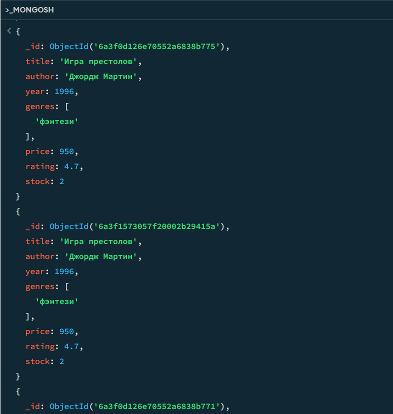

**Задание 4. Ограничение количества результатов**

## Постановка задачи

Реализовать пагинацию.

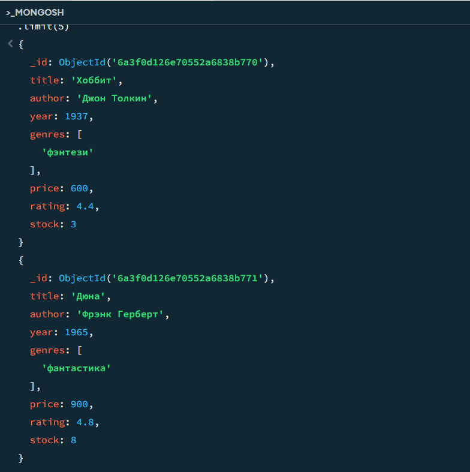

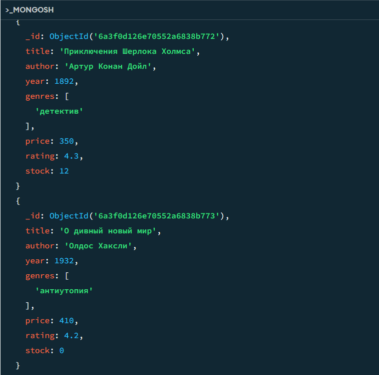

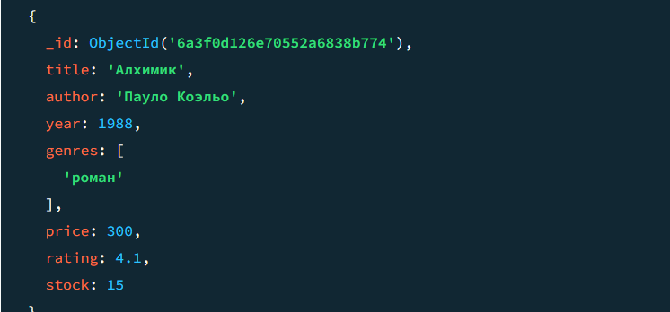

**Задание 5. Комплексный запрос**

## Постановка задачи

Создать запрос:

* найти книги жанра "фантастика";
* вывести только название и цену;
* отсортировать по цене.

---

Поиск, проекция и сортировка одновременно

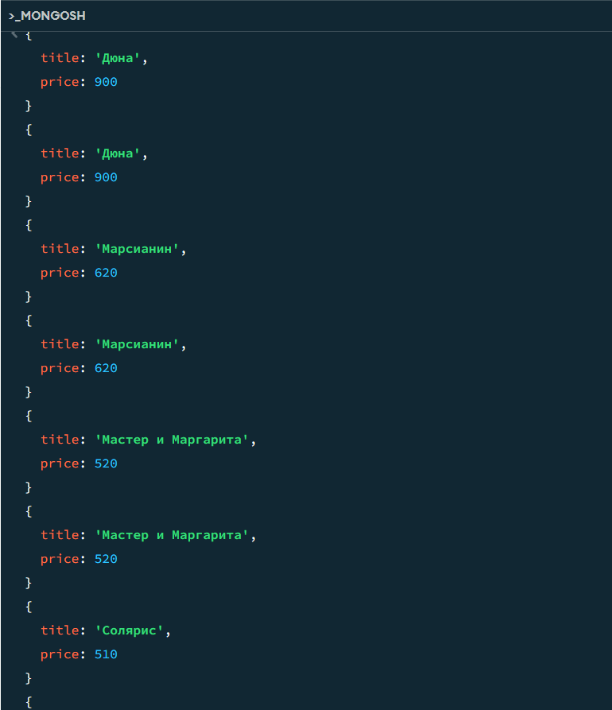

## Уровень 2. Обновление и удаление документов (15 баллов)

**Задание 6. Обновление одного документа**

## Постановка задачи

Изменить рейтинг одной книги.

---

Изменяется только первый найденный документ

**Задание 7. Массовое обновление документов**

## Постановка задачи

Увеличить цену всех книг автора.

---

Увеличение цены всех книг автора

**Задание 8. Работа с массивами**

## Постановка задачи

Добавить и удалить жанры книги.

---

Добавление нового жанра в массив genres

Удаление жанра из массива genres

**Задание 9. Удаление документов**

Сначала получить идентификатор:

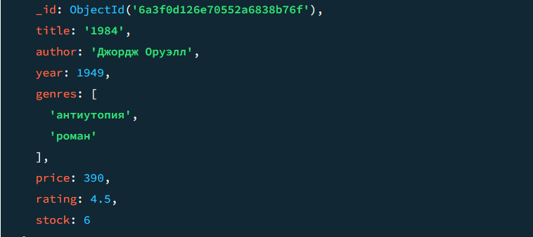

Удаление конкретного документа по уникальному ID

Удаление книг, которых нет на складе

## Уровень 3. Агрегация MongoDB (20 баллов)

**Задание 10. Построение Aggregation Pipeline**

## Постановка задачи

Получить статистику:

* только книги после 1900 года;
* группировка по жанрам;
* количество книг;
* средняя цена;
* сортировка по количеству.

---

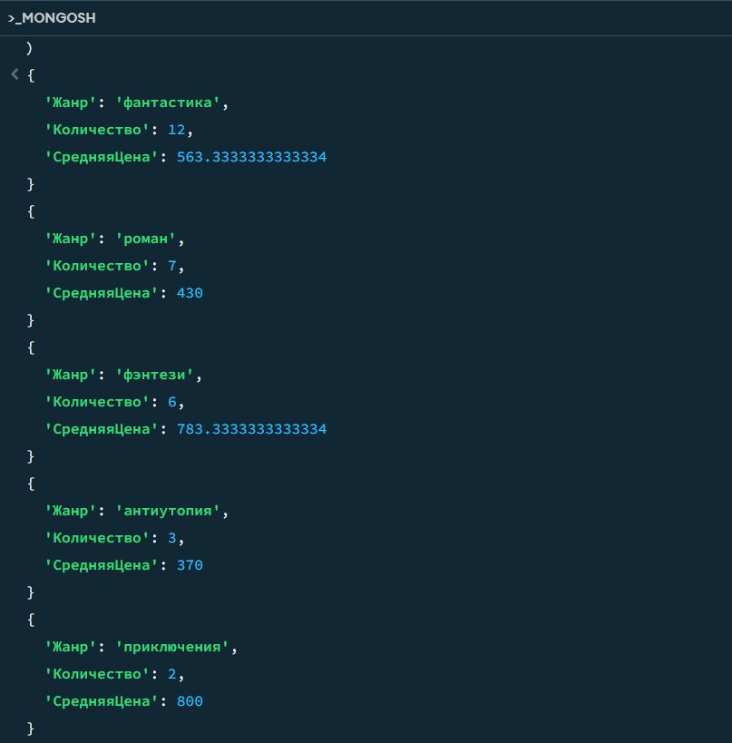

**Задание 12. Создание составного индекса**

**Задание 13. Анализ запроса после создания индекса**

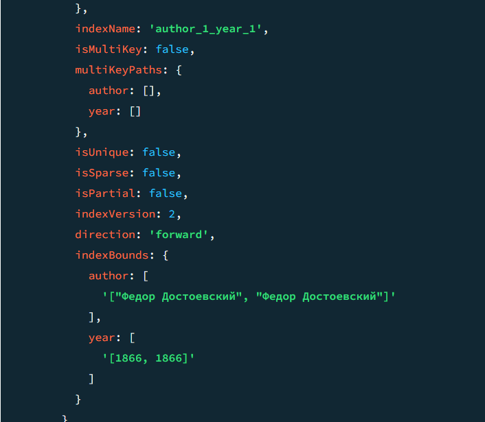

До создания индекса: totalDocsExamined = 20. MongoDB просмотрела все 20 документов коллекции.

После создания составного индекса {author: 1, year: 1}: totalDocsExamined = 1. СУБД использовала индекс, благодаря чему нашла нужный документ, просмотрев всего 1 документ.

**Вывод:** Индекс значительно сокращает количество просматриваемых документов и ускоряет выполнение запроса, особенно на больших объёмах данных.

Тест:

1. Что является аналогом таблицы в реляционной базе данных SQL в MongoDB?

B) Collection

2. Какой оператор MongoDB используется для увеличения числового значения поля?

B) $inc

3. Какой метод изменяет только один документ, даже если найдено несколько совпадений?

B) updateOne()

4. Для чего создаются индексы в MongoDB?

B) Для ускорения поиска данных

## Открытые вопросы

*1. Объясните разницу между вложенными документами и ссылками между коллекциями MongoDB.
---
Я считаю, что разница между вложенными документами и ссылками между коллекциями MongoDB очевидна:

**Вложенные документы** удобны, когда связанные данные почти всегда запрашиваются вместе с основным документом и не существуют отдельно. Например, отзывы к книге или адрес пользователя. 

**Плюсы:** один запрос – все данные, атомарность обновлений. 

**Минусы:** дублирование, если одни и те же данные нужны в разных документах; размер документа может расти, что замедляет чтение и запись.

**Ссылки между коллекциями** (аналог внешних ключей) используются, когда данные имеют самостоятельную ценность и часто изменяются независимо. 

Например, информация о книге и об авторе, если у автора много книг и его данные могут обновляться. Тогда хранят author_id. 

**Плюсы:** отсутствие дублирования, нормализация. 

**Минусы:** для получения полной информации нужны дополнительные запросы (или $lookup), что сложнее и медленнее.

**Выбор влияет на производительность:** вложенные документы дают быстрый доступ, но при частых обновлениях могут возникать конфликты; ссылки более гибкие, но увеличивают число операций чтения.

*2. Объясните, как работает индекс MongoDB.
---
Индекс MongoDB работает таким образом, что

- При создании **индекса MongoDB** строит **дополнительную структуру** данных (B-дерево), хранящую значения проиндексированных полей и указатели на документы. Эта структура отсортирована, что позволяет быстро находить нужные значения бинарным поиском.

- Без индекса запрос вынужден просматривать каждый документ коллекции (collection scan), поэтому **totalDocsExamined** равно количеству всех документов. С индексом СУБД сначала находит в индексе подходящие значения и затем загружает только соответствующие документы, поэтому **totalDocsExamined** уменьшается до числа реально подходящих документов.

- Поиск по индексированному полю быстрее, потому что сложность поиска **O(log N)** вместо **O(N)**, где **N** – количество документов. Составной индекс (author, year) может полностью покрыть запрос, исключая обращение к самим документам, что ещё быстрее.
