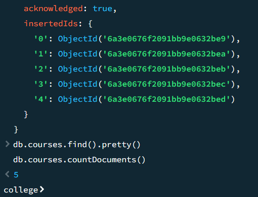
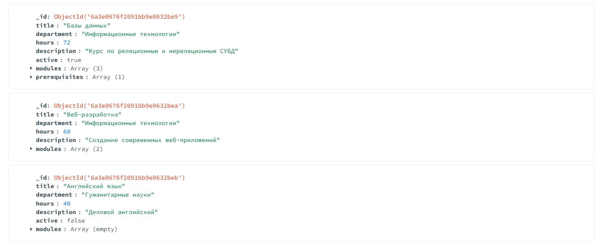
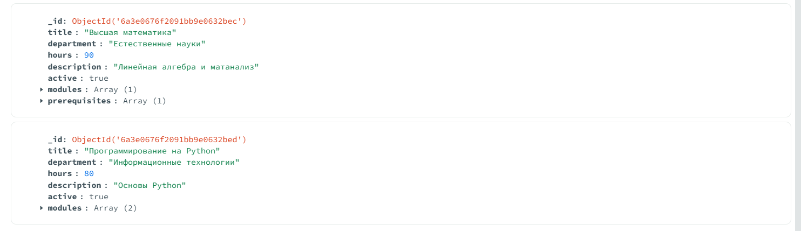
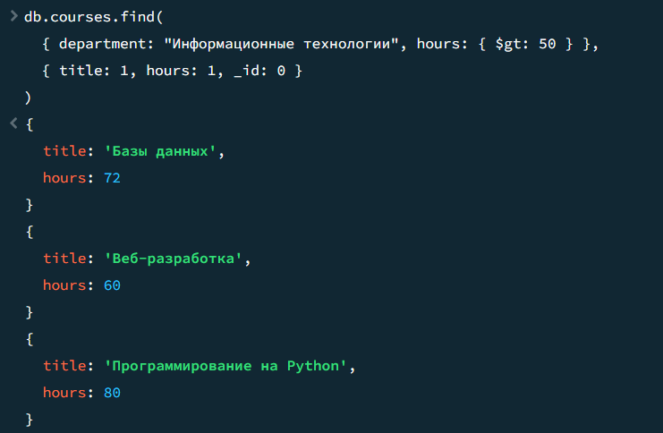
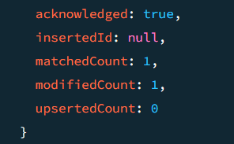
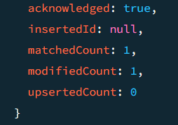
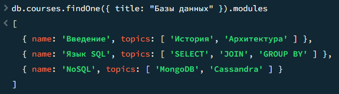

## Отчёт по лабораторной работе  
**Тема:** Документо-ориентированная СУБД MongoDB: CRUD-операции, вложенные структуры и индексы  

### Цель работы  
Освоить создание БД и коллекций, выполнение CRUD-операций, работу с массивами и вложенными объектами, создание индексов и анализ производительности, а также использование конвейера агрегации в MongoDB.

---

### Задача 1. Создание коллекции и вставка документов с гибкой схемой

**Задание:**  
Создать БД `college`, коллекцию `courses` и вставить 5 документов с разной структурой.

**Листинг команд и результаты:**

```javascript
use college

db.createCollection("courses")

db.courses.insertMany([
  {
    title: "Базы данных",
    department: "Информационные технологии",
    hours: 72,
    description: "Курс по реляционным и нереляционным СУБД",
    active: true,
    modules: [
      { name: "Введение", topics: ["История", "Архитектура"] },
      { name: "SQL", topics: ["SELECT", "JOIN", "GROUP BY"] },
      { name: "Устаревший модуль", topics: ["Старая тема"] }
    ],
    prerequisites: ["Основы программирования"]
  },
  {
    title: "Веб-разработка",
    department: "Информационные технологии",
    hours: 60,
    description: "Создание современных веб-приложений",
    // active отсутствует умышленно
    modules: [
      { name: "HTML/CSS", topics: ["Семантика", "Flexbox"] },
      { name: "JavaScript", topics: ["ES6", "DOM"] }
    ]
    // prerequisites отсутствует
  },
  {
    title: "Английский язык",
    department: "Гуманитарные науки",
    hours: 40,
    description: "Деловой английский",
    active: false,
    modules: []   // пустой массив модулей
  },
  {
    title: "Высшая математика",
    department: "Естественные науки",
    hours: 90,
    description: "Линейная алгебра и матанализ",
    active: true,
    modules: [
      { name: "Матрицы", topics: ["Определители", "СЛАУ"] }
    ],
    prerequisites: ["Школьная математика"]
  },
  {
    title: "Программирование на Python",
    department: "Информационные технологии",
    hours: 80,
    description: "Основы Python",
    active: true,
    modules: [
      { name: "Синтаксис", topics: ["Переменные", "Циклы"] },
      { name: "ООП", topics: ["Классы", "Наследование"] }
    ]
  }
])
```

**Результат и проверка:**  



Выводятся 5 документов с разной структурой:  




- «Веб-разработка» – нет поля `active` и `prerequisites`.  
- «Английский язык» – `modules` пуст, `active: false`.  
- «Базы данных» содержит `prerequisites` и модуль «Устаревший модуль».

---

### Задача 2. Чтение данных: фильтрация, проекция, логические операторы

**Задание 2.1** – курсы кафедры «Информационные технологии» с часами > 50.

```javascript
db.courses.find({
  department: "Информационные технологии",
  hours: { $gt: 50 }
})
```
**Вывод (сокращённо):**
```
[
  { _id: ..., title: 'Базы данных', ... hours: 72 },
  { _id: ..., title: 'Веб-разработка', ... hours: 60 },
  { _id: ..., title: 'Программирование на Python', ... hours: 80 }
]
```

**Задание 2.2** – проекция только `title` и `hours`, без `_id`.

```javascript
db.courses.find(
  { department: "Информационные технологии", hours: { $gt: 50 } },
  { title: 1, hours: 1, _id: 0 }
)
```
**Вывод:**



**Задание 2.3** – курсы, где `active: true` ИЛИ `hours = 60`.

```javascript
db.courses.find({
  $or: [
    { active: true },
    { hours: 60 }
  ]
})
```
**Результат:** попадают все курсы с `active: true` («Базы данных», «Высшая математика», «Python»), а также «Веб-разработка», у которой `hours: 60` (даже при отсутствующем `active`).  
«Английский язык» (`active: false`, `hours: 40`) не попадает.

---

### Задача 3. Обновление документов: модификация полей и массивов

**Задание:** одним `updateOne` увеличить часы на 10, установить `active: true`, добавить модуль «NoSQL» в курс «Базы данных».

```javascript
db.courses.updateOne(
  { title: "Базы данных" },
  {
    $inc: { hours: 10 },
    $set: { active: true },
    $push: { modules: { name: "NoSQL", topics: ["MongoDB", "Cassandra"] } }
  }
)
```
**Результат:**  


```

**Проверка:**
```javascript
db.courses.findOne({ title: "Базы данных" })
```
Теперь документ содержит:
- `hours: 82` (было 72),
- `active: true` (уже было, но операция гарантирует),
- в массиве `modules` добавлен новый элемент `{ name: "NoSQL", topics: ["MongoDB", "Cassandra"] }`.

---

### Задача 4. Работа с массивами и вложенными объектами: поиск и модификация элементов

**Задание 4.1** – найти курсы, где есть модуль с именем "SQL".

```javascript
db.courses.find({ modules: { $elemMatch: { name: "SQL" } } })
```
**Вывод:** только документ «Базы данных» (после переименования модуля SQL всё равно пока присутствует, так как мы ещё не переименовывали в этом шаге; по условию шаг 4.1 выполняется до переименования).

**Задание 4.2** – удалить модуль «Устаревший модуль» из всех документов.

```javascript
db.courses.updateMany(
  { "modules.name": "Устаревший модуль" },
  { $pull: { modules: { name: "Устаревший модуль" } } }
)
```
**Результат:** 



**Проверка:**
```javascript
db.courses.find({ "modules.name": "Устаревший модуль" })
// пустой результат
```

**Задание 4.3** – переименовать модуль "SQL" в "Язык SQL" в курсе «Базы данных».

```javascript
db.courses.updateOne(
  { title: "Базы данных", "modules.name": "SQL" },
  { $set: { "modules.$.name": "Язык SQL" } }
)
```
**Проверка:**
```javascript
db.courses.findOne({ title: "Базы данных" }).modules
```



Массив модулей теперь содержит `{ name: "Язык SQL", topics: ... }` вместо `"SQL"`.

---

### Задача 5. Создание индексов и анализ производительности

**Задание 5.1** – анализ без индекса.

```javascript
db.courses.find({ department: "Информационные технологии" }).explain("executionStats")
```
**Ключевой фрагмент:**
```
winningPlan: {
  stage: 'COLLSCAN',
  filter: { department: { '$eq': 'Информационные технологии' } },
  direction: 'forward'
},
executionStats: {
  executionSuccess: true,
  nReturned: 3,
  executionTimeMillis: 0,
  totalKeysExamined: 0,
  totalDocsExamined: 5
}
```
Видим полный скан коллекции (`COLLSCAN`), просмотрены все 5 документов.

**Задание 5.2** – создание индекса по `department`.

```javascript
db.courses.createIndex({ department: 1 })
// department_1
```

**Задание 5.3** – повторный explain.

```javascript
db.courses.find({ department: "Информационные технологии" }).explain("executionStats")
```
**Фрагмент:**
```
winningPlan: {
  stage: 'FETCH',
  inputStage: {
    stage: 'IXSCAN',
    keyPattern: { department: 1 },
    indexName: 'department_1',
    ...
  }
},
executionStats: {
  nReturned: 3,
  executionTimeMillis: 0,
  totalKeysExamined: 3,
  totalDocsExamined: 3
}
```
Теперь используется индекс (`IXSCAN`), просмотрено ровно 3 ключа и 3 документа, а не 5.

**Задание 5.4** – составной индекс.

```javascript
db.courses.createIndex({ department: 1, hours: 1 })
```

**Задание 5.5** – запрос с фильтрацией и сортировкой по `hours`.

```javascript
db.courses.find({ department: "Информационные технологии" }).sort({ hours: 1 }).explain("executionStats")
```
**Фрагмент:**
```
winningPlan: {
  stage: 'FETCH',
  inputStage: {
    stage: 'IXSCAN',
    keyPattern: { department: 1, hours: 1 },
    indexName: 'department_1_hours_1',
    ...
  }
},
executionStats: {
  executionTimeMillis: 0,
  totalKeysExamined: 3,
  totalDocsExamined: 3
}
```
План показывает использование составного индекса, сортировка реализуется самим индексом (без дополнительной стадии `SORT`).  
Время выполнения мало из-за крошечной коллекции, но ключевой показатель – смена `COLLSCAN` на `IXSCAN` и уменьшение числа просмотренных документов.

---

### Задача 6. Агрегация: группировка и вычисление статистики

**Задание:** сгруппировать по кафедрам, посчитать количество курсов, суммарные и средние часы, отсортировать по убыванию числа курсов.

```javascript
db.courses.aggregate([
  {
    $group: {
      _id: "$department",
      count: { $sum: 1 },
      totalHours: { $sum: "$hours" },
      avgHours: { $avg: "$hours" }
    }
  },
  { $sort: { count: -1 } }
])
```
**Результат:**
```
[
  { _id: 'Информационные технологии', count: 3, totalHours: 222, avgHours: 74 },
  { _id: 'Естественные науки', count: 1, totalHours: 90, avgHours: 90 },
  { _id: 'Гуманитарные науки', count: 1, totalHours: 40, avgHours: 40 }
]
```
(Часы «Баз данных» были увеличены до 82, поэтому сумма ИТ: 82+60+80 = 222, среднее 74.)

Проверка: для ИТ – три курса, сумма 222, верно. Сортировка: ИТ наверху.

---

### Вывод по лабораторной работе

В ходе работы были практически изучены ключевые особенности MongoDB.  
- Гибкая схема позволила в одной коллекции хранить документы с разным набором полей: у одних курсов отсутствовало поле `active` или `prerequisites`, у других был пустой массив модулей.  
- Вложенные объекты и массивы дали возможность хранить информацию о модулях и темах в одном документе, избегая жёсткой нормализации.  
- Операторы обновления (`$inc`, `$set`, `$push`, `$pull`, позиционный `$`) позволили точечно менять отдельные элементы массивов и добавлять поля.  
- Создание индексов кардинально изменило план выполнения запросов с полного перебора коллекции (`COLLSCAN`) на индексный доступ (`IXSCAN`), что особенно важно при больших объёмах данных.  
- Конвейер агрегации позволил выполнить группировку и вычислить статистику по кафедрам, аналогично `GROUP BY` в SQL.  

Полученные навыки являются основой для проектирования схем и оптимизации запросов в реальных проектах на MongoDB.

---

### Ответы на контрольные вопросы

1. **Чем BSON отличается от JSON? Дополнительные типы BSON.**  
   BSON (Binary JSON) – это бинарное представление JSON-подобных документов. В отличие от текстового JSON, BSON поддерживает дополнительные типы: `Date`, `ObjectId`, `BinData`, `Decimal128`, `Long`, `Timestamp`, `MinKey`, `MaxKey` и другие. Он более компактный и эффективный для парсинга.

2. **Что означает «гибкая схема» в MongoDB? Пример из работы.**  
   Гибкая схема означает, что документы одной коллекции могут иметь разный набор полей. Например, в коллекции `courses` документ «Веб-разработка» не содержит поля `active` и `prerequisites`, а «Английский язык» имеет пустой массив `modules`. Это позволяет легко развивать модель данных без миграции схемы.

3. **Операторы добавления, удаления и обновления элементов массива с синтаксисом.**  
   - Добавление: `$push: { <поле>: <элемент> }` – добавляет в конец.  
   - Удаление: `$pull: { <поле>: <условие> }` – удаляет все элементы, удовлетворяющие условию.  
   - Обновление конкретного элемента: позиционный оператор `$` в сочетании с `$set`: `{ $set: { "<массив>.$.<поле>": значение } }`.

4. **Когда возникает COLLSCAN и как заменить на IXSCAN?**  
   `COLLSCAN` (полное сканирование коллекции) появляется, когда запрос не может использовать индекс (нет подходящего индекса, или фильтр неселективен). Для замены на `IXSCAN` необходимо создать индекс, соответствующий полям фильтрации, сортировки или проекции.

5. **Разница между `$set`, `$inc` и `$push`.**  
   - `$set` – устанавливает значение поля (добавляет, если отсутствует).  
   - `$inc` – атомарно увеличивает/уменьшает числовое поле на заданную величину.  
   - `$push` – добавляет новый элемент в массив.  
   Применяются соответственно для обычного обновления/добавления полей, счётчиков и работы со списками.

6. **Назначение `$elemMatch`. Как работает с массивами вложенных объектов?**  
   `$elemMatch` позволяет указать несколько условий, которые должны выполняться **в одном элементе** массива. Например, `{ modules: { $elemMatch: { name: "SQL" } } }` находит документы, где хотя бы один модуль имеет имя `"SQL"`. Без `$elemMatch` обычный фильтр `{ "modules.name": "SQL", "modules.topics": "JOIN" }` искал бы любое совпадение среди разных элементов, а не обязательно в одном.

